# 🛍️ Full Stack E-Commerce Web Application

A fully functional **MERN Stack** E-Commerce platform with a user-friendly frontend, secure backend, and admin dashboard. This project covers user login/signup, cart persistence, and product management using MongoDB Atlas, React.js, Node.js, Express.js, and Multer.

---

## 📂 Project Structure

```bash
fullstack-ecommerce-webapp/
├── frontend/         # React.js user interface
├── backend/          # Node.js + Express backend APIs
├── admin/            # Admin dashboard for managing products
└── screenshots/      # Project UI screenshots
```

---

## 🚀 Features

### 👤 User Module (Frontend)
- User **signup/login** (email must be unique)
- View products by category: **Men / Women / Kids**
- Product details with image, name, old/new prices, sizes, description, reviews
- Persistent **cart**, even after logout
- **Breadcrumb navigation** for user clarity

### ⚙️ Backend Module
- Built with **Node.js + Express**
- MongoDB Atlas database connection using **Mongoose**
- Auth-token generation on login using JWT
- Cart linked to individual users via tokens
- Secure API endpoints tested via **Postman**

### 🛠️ Admin Module
- Add product (name, old/new price, category, image)
- Automatically generates product ID in DB
- List products with edit/delete options
- All data synced to MongoDB Atlas

---

## 💻 Technologies Used

| Area       | Technologies                                   |
|------------|------------------------------------------------|
| Frontend   | React.js, HTML, CSS, JavaScript               |
| Backend    | Node.js, Express.js                           |
| Database   | MongoDB Atlas, Mongoose                       |
| Tools      | Multer (image upload), Postman, npm           |
| Auth       | JWT (JSON Web Tokens)                         |

---

## 🛠️ Getting Started

### 📦 Prerequisites
- Node.js and npm installed
- MongoDB Atlas URI (add to `.env` file in backend)

### 🔧 Setup Instructions

```bash
# 1. Clone the repo
https://github.com/RojaSriTallapragada/fullstack-ecommerce-webapp.git

# 2. Navigate into each module and install dependencies

cd frontend
npm install
npm start

cd ../backend
npm install
node index.js

cd ../admin
npm install
npm run dev
```

### 🔐 Sample .env (backend)
```env
MONGODB_URI=mongodb+srv://<username>:<password>@cluster.mongodb.net/ecommerce
JWT_SECRET=your_jwt_secret
PORT=5000
```

---

## 🖼️ Screenshots

### 🏠 Home Page
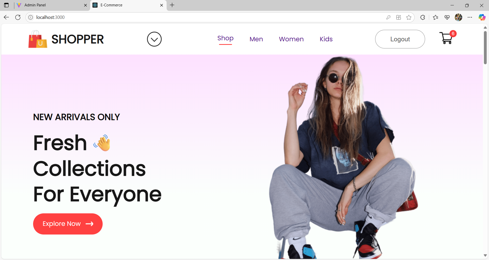

### 📦 Popular & New Collections
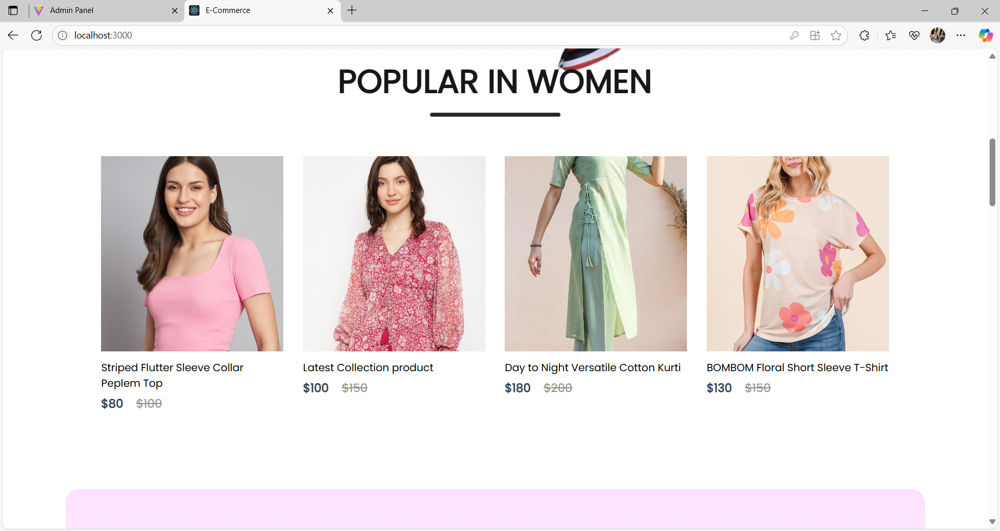  
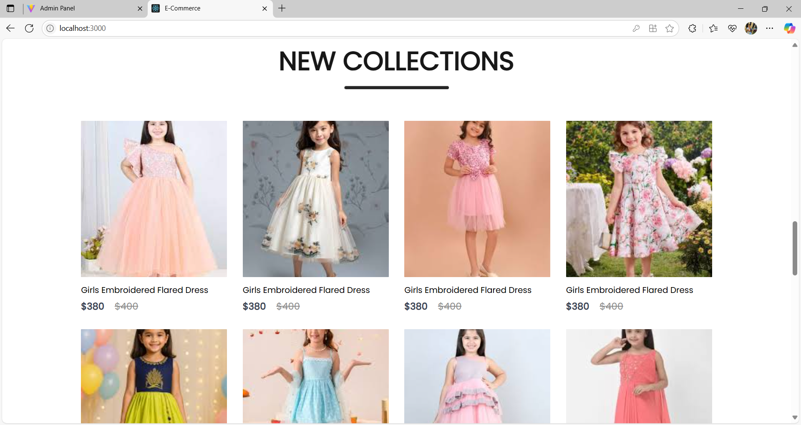

### ✉️ Newsletter & Category View
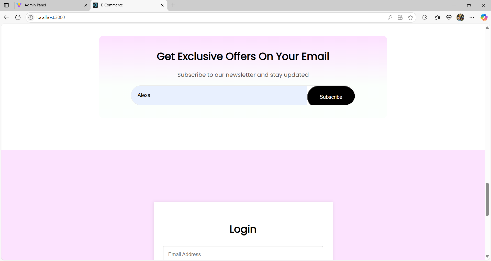  
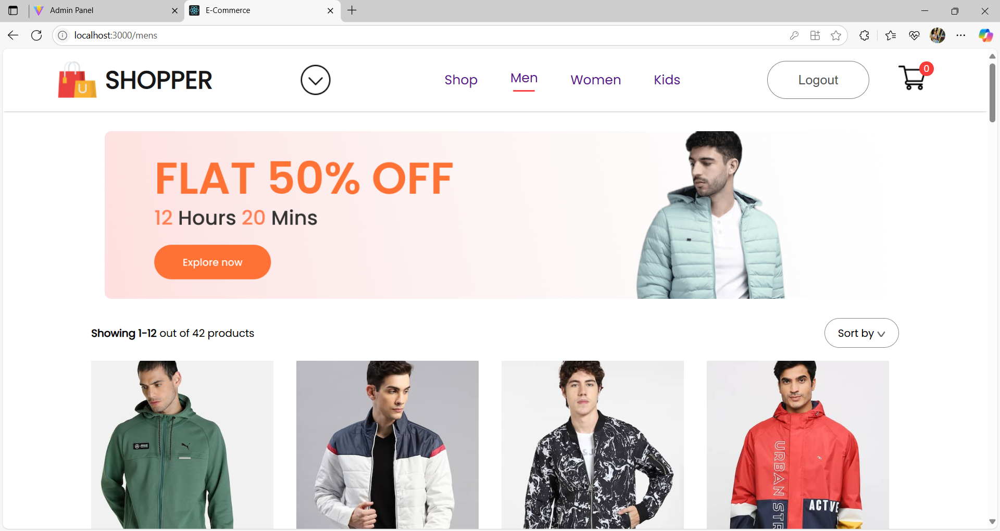

### 🔐 Login / Signup
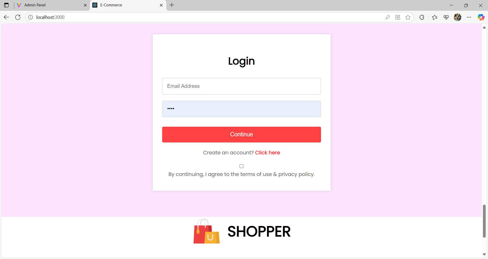

### 🛒 Cart Page
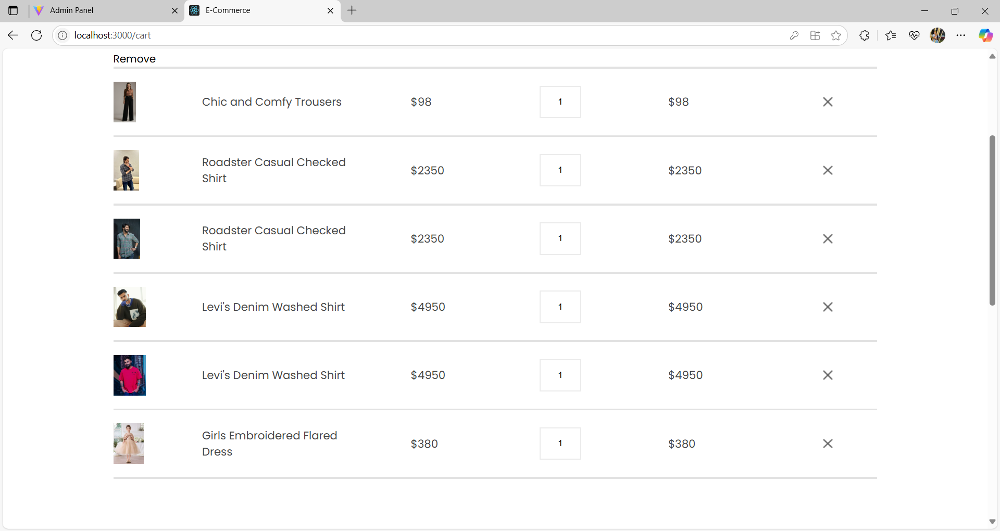

### 📄 Product Details
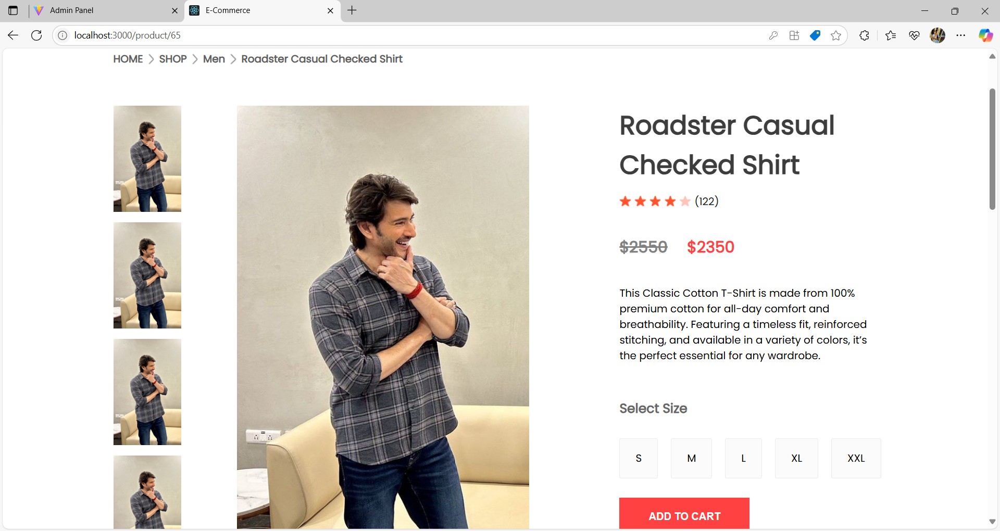

### 🔗 Related Products
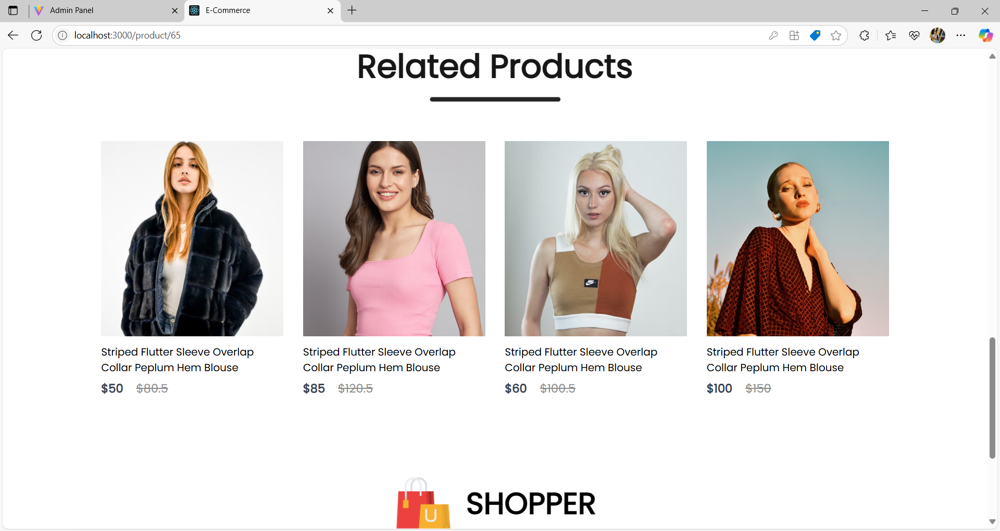

### 🛠️ Admin - Add Product
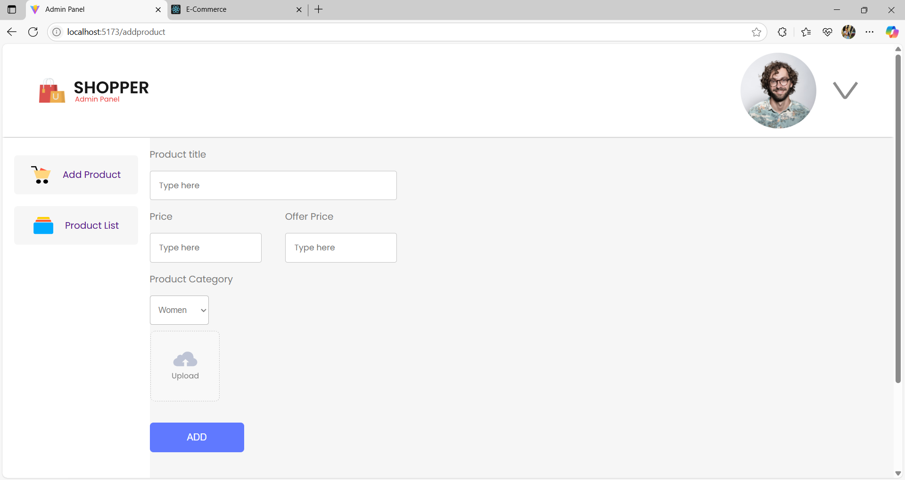

### 📋 Admin - List Products
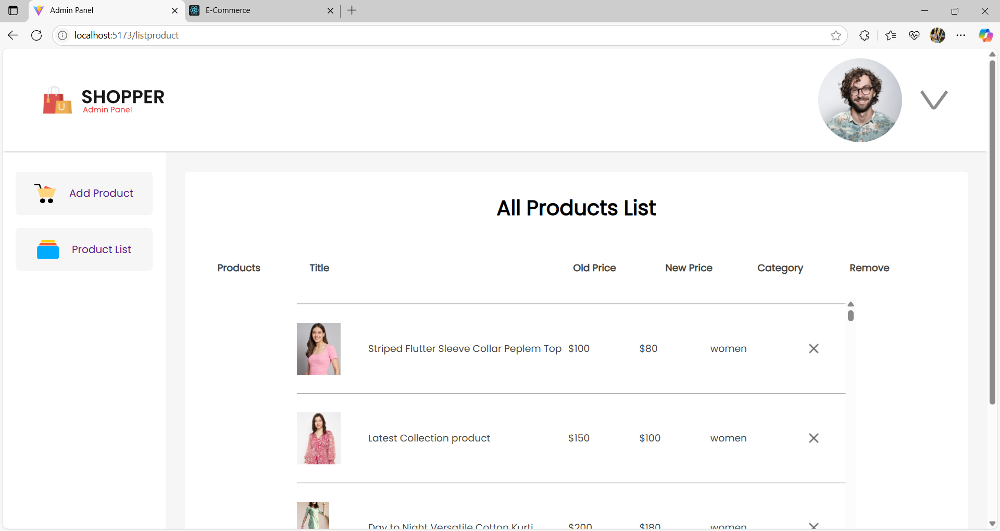

### 📊 MongoDB Views
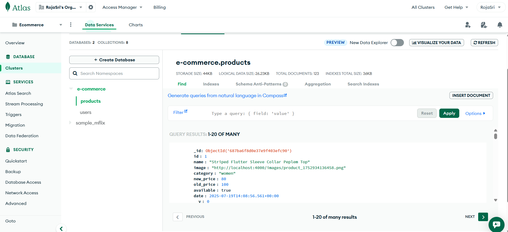  
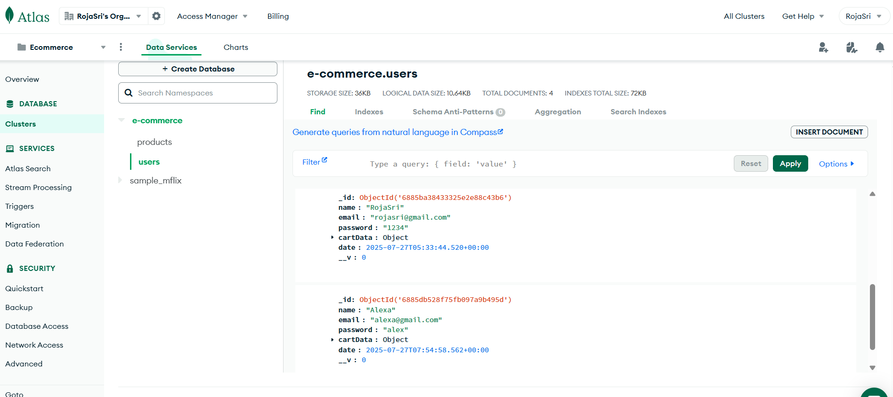

---

## 📃 License
This project is licensed under the **MIT License**. Feel free to fork, customize, and use it in your own projects!

---

## 🙌 Acknowledgements
- Built with guidance from a YouTube tutorial and extended with personalized features.

---

**Created by [RojaSri Tallapragada](https://github.com/RojaSriTallapragada)**  
Aspiring Software Developer
📧 rojasritallapragada@gmail.com
